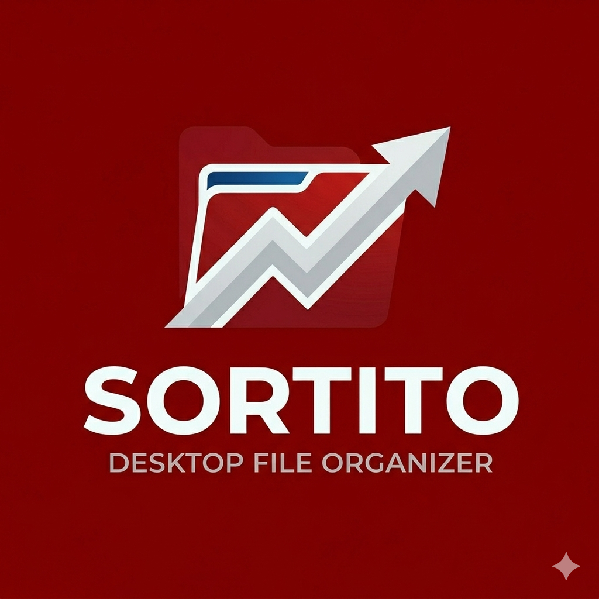

<!-- SORTITO README - Modern & Cool -->

<p align="center">
  
</p>

<h1 align="center">SORTITO</h1>
<p align="center">
  <strong>Desktop File Organizer – Recursively sort videos & photos in one click.</strong>
</p>

<p align="center">
  <a href="https://github.com/GreyHatSonawane/SORTITO/releases/tag/v1.0">
    
  </a>
  <a href="https://github.com/GreyHatSonawane/SORTITO">
    
  </a>
  <a href="LICENSE">
    
  </a>
</p>

<p align="center">
  
  
  
  
  
</p>

---

## 📥 Download

> **Ready to use?** Grab the latest portable executable (no installation needed).

<p align="center">
  <a href="https://github.com/GreyHatSonawane/SORTITO/releases/tag/v1.0">
    
  </a>
</p>

---

## ✨ What is SORTITO?

**SORTITO** is a modern desktop application that **recursively scans any folder** (including all subfolders) and automatically sorts your **video** and **photo** files into dedicated `videos/` and `photos/` folders. No more manual dragging – just select a folder and click start.

### Key Features

| Feature | Description |
|---------|-------------|
| 🌀 **Recursive scan** | Goes through every subfolder, no limit on depth. |
| 📹 **Smart detection** | Recognises 30+ video & photo formats (easily extensible). |
| 🔄 **Copy / Move** | Choose to duplicate or relocate files. |
| 🏷️ **Duplicate handling** | Automatically renames conflicting files (`file_1.mp4`). |
| 📁 **“Others” folder** | Optionally collect all non‑media files. |
| 🌗 **Dark / Light theme** | Toggle instantly, follows system preference. |
| 📊 **Progress + ETA** | Real‑time percentage and estimated time remaining. |
| ⏹️ **Cancel anytime** | Safe stop – already processed files are kept. |
| 🪶 **Portable .exe** | Single file, no Python installation required. |

---

## 🖼️ Screenshots

<p align="center">
  
  &nbsp;&nbsp;
  
</p>

---

## 🧰 Tech Stack

<p align="center">
  
</p>

- **Python 3.8+** – Core logic and cross‑platform support.
- **CustomTkinter** – Modern, flat, rounded GUI.
- **Pillow (PIL)** – Image handling and icon processing.
- **PyInstaller** – Bundles everything into a single `.exe`.
- **Tkinter** – Native file dialogs and base windowing.

---

## 🚀 Quick Start

### Option 1: Run the executable (Windows)
1. Download `SORTITO.exe` from the [Releases](../../releases) page.
2. Double‑click to launch – no installation needed.
3. Select a source folder, choose options, and click **Start Sorting**.

### Option 2: Run from source (Python)
```bash
# Clone the repository
git clone https://github.com/GreyHatSonawane/SORTITO.git
cd SORTITO

# Install dependencies
pip install customtkinter pillow

# Run the app
python media_sorter_gui.py
